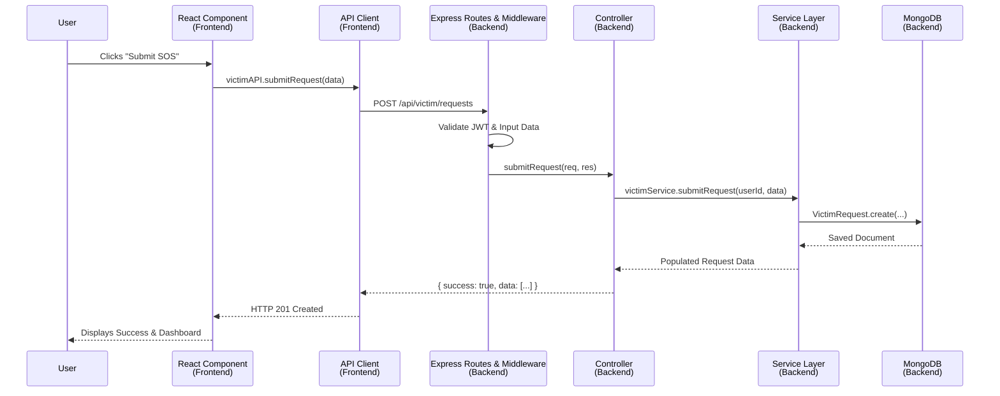

# CrisisConnect Data Flow Guide

To understand how CrisisConnect works, let's trace exactly what happens when a user performs an action. We'll use the example of a **Victim submitting a new SOS Request**.

Here is the high-level architecture diagram:



---

## 1. The Frontend (React UI)
*File: `Crisis_frontend/src/pages/victim/VictimSubmitRequest.jsx`*

It starts when the user interacts with the UI. The user fills out a form containing information like `needType` (e.g., "food") and `description`. When they hit "Submit", the React component gathers this state into a data object.

It then passes this data to the **API Layer**.

## 2. The API Client (Axios)
*File: `Crisis_frontend/src/api/index.js` & `axios.js`*

The frontend doesn't talk to the backend directly; it uses **Axios** (an HTTP client).
In `axios.js`, an interceptor automatically fetches the logged-in user's JWT token from `localStorage` and attaches it to the request header so the backend knows *who* is making the request.

```javascript
// From index.js
export const victimAPI = {
  submitRequest: (data) => api.post('/victim/requests', data),
}
```
A native HTTP `POST` request is fired off to `http://localhost:5000/api/victim/requests`.

---

## 3. The Router & Middleware (Express)
*File: `Crisis_backend/routes/victim.routes.js`*

The backend receives the HTTP request at the server. `server.js` forwards it to the correct router file. In `victim.routes.js`, the request hits a gauntlet of **Middleware**:

1. **`protect`**: Verifies the JWT token to ensure the user is logged in.
2. **`authorise('victim')`**: Checks if the logged-in user's role is strictly `victim`.
3. **`express-validator` checks**: Ensures the body contains exactly what we expect (e.g., `description` isn't empty, `needType` is valid).
4. **`validate`**: If any of those checks fail, it immediately spits back a `400 Bad Request` without hitting the controller.

If all tests pass, the request is handed to the Controller.

## 4. The Controller (Traffic Cop)
*File: `Crisis_backend/controllers/victim.controller.js`*

The Controller's job is to be very "thin." It shouldn't contain complex algorithms or database interactions. It has three simple jobs:
1. Extract exactly what is needed from the Express `req` object (like `req.user._id` and `req.body`).
2. Pass those pieces to the **Service Layer**.
3. Take what the Service Layer returns (or any errors thrown) and map it to a standard JSON HTTP response.

```javascript
// Excerpt
const request = await victimService.submitRequest(req.user._id, req.body);
return successResponse(res, 201, 'SOS request submitted successfully', request);
```

---

## 5. The Service Layer (Business Logic)
*File: `Crisis_backend/services/victim.service.js`*

This is the brain of the backend. If you want to know *how* CrisisConnect works underneath, you look at the services. 
The service receives the raw ingredients (the victim's ID and the form data). It interacts with the **Mongoose Database Models**.

```javascript
// Excerpt
const request = await VictimRequest.create({
  victim: victimId,
  needType: data.needType,
  description: data.description,
  // ...
});
// Get extra data before returning
await request.populate('victim', 'name email phone');
return request;
```
If an assignment couldn't be made, or if a user didn't exist, the service layer would throw an `Error`, which the Controller would automatically catch and turn into a `400` or `404` HTTP response.

## 6. The Database (MongoDB & Mongoose)
*File: `Crisis_backend/models/VictimRequest.js`*

Mongoose receives the `create` command from the service layer. It validates the data one final time against the Schema definitions (checking types, constraints, and defaults). 

It writes the data to the MongoDB disk and triggers any database-level operations, such as automatically generating a unique `_id` and creating `createdAt`/`updatedAt` timestamps.

---

## The Journey Back Up

Once the data is saved in MongoDB:
1. Mongoose returns the saved JSON document to the **Service**.
2. The **Service** returns it to the **Controller**.
3. The **Controller** packages it nicely into a standard response object: `{ success: true, data: { ... } }` and sends a `201` HTTP signal.
4. **Axios** on the frontend catches the `201` signal and resolves the JavaScript Promise.
5. The **React Component** receives the data, stops the loading spinner, updates the UI, and navigates the user back to the Victim Dashboard.

**This exact same "V" pattern (Frontend → Network → Router → Controller → Service → DB → Service → Controller → Network → Frontend) is used for every single feature in this application!**
